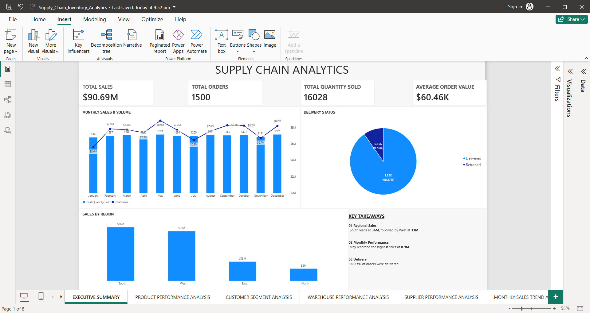
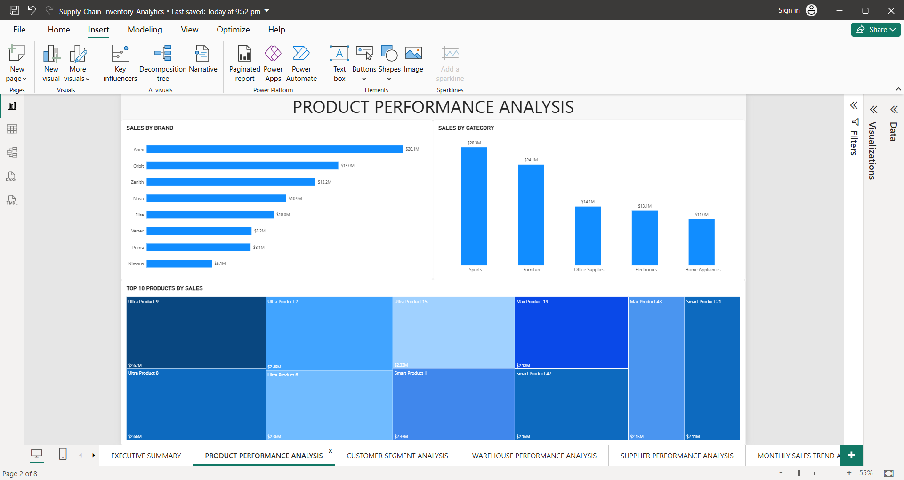
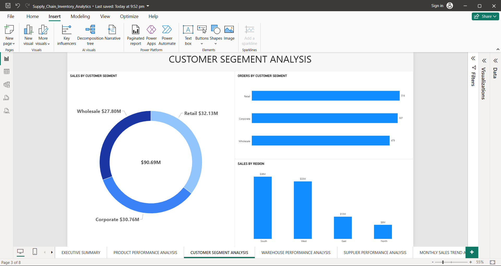
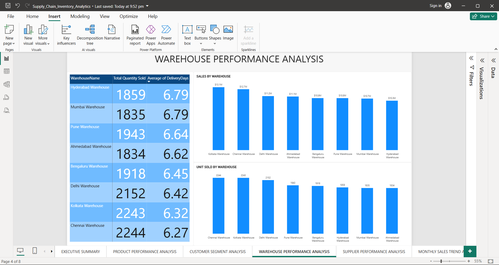
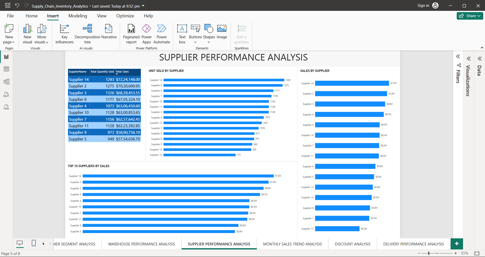
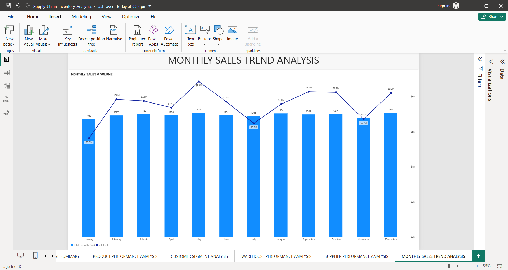
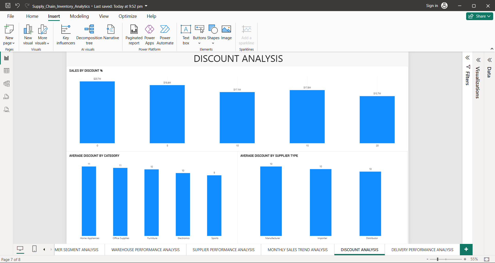
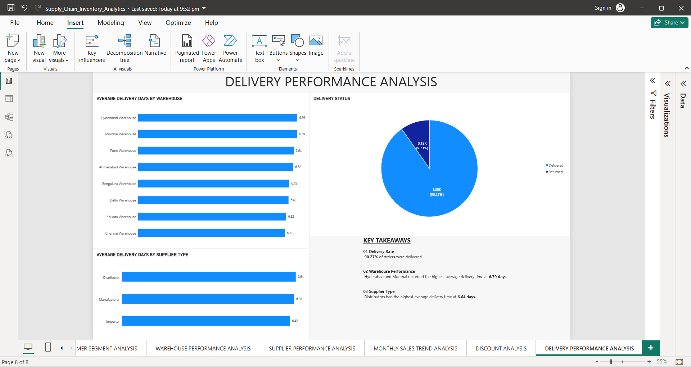

# Supply Chain Analytics – Power BI

A Power BI dashboard project focused on analyzing sales, orders, customers, products, warehouses, suppliers, discounts, and delivery performance.

## Dashboard Preview

### Other Dashboard Pages

## Project Overview

This project uses Power BI to explore supply chain data and identify important business patterns across sales, customers, products, warehouses, suppliers, and delivery operations.

The dashboard is designed to provide both an executive-level overview and detailed operational analysis.

## Dashboard Pages

The report contains 8 analytical pages:

1. Executive Summary
2. Product Performance Analysis
3. Customer Segment Analysis
4. Warehouse Performance Analysis
5. Supplier Performance Analysis
6. Monthly Sales Trend Analysis
7. Discount Analysis
8. Delivery Performance Analysis

## Key Metrics

- Total Sales: ₹90.69M
- Total Orders: 1,500
- Total Quantity Sold: 16,028
- Average Order Value: ₹60.46K
- Delivery Rate: 90.27%

## Key Analysis

### Product Performance
- Sports generated the highest category sales at approximately ₹28.3M.
- Apex was the highest-performing brand at approximately ₹20.1M.
- Ultra Product 9 was the largest individual product in the Top 10 product analysis.

### Customer Segments
- Retail generated the highest sales at approximately ₹32.13M.
- Retail also recorded the highest order volume with 514 orders.
- South generated approximately ₹36M in sales, followed by West at approximately ₹33M.

### Warehouse Performance
- Chennai recorded the highest quantity sold with 2,244 units.
- Kolkata followed closely with 2,243 units.
- Chennai had the lowest average delivery time at 6.27 days.
- Hyderabad and Mumbai recorded the highest average delivery time at 6.79 days.

### Supplier Performance
- Supplier 14 recorded the highest sales at approximately ₹7.22M.
- Supplier 2 followed with approximately ₹7.03M.
- Supplier 14 also recorded the highest quantity sold in the supplier analysis.

### Monthly Sales Trend
- May recorded the highest monthly sales at approximately ₹8.9M.
- January recorded the lowest monthly sales at approximately ₹5.6M.
- Monthly sales showed fluctuations throughout the year rather than a continuous upward or downward trend.

### Discount Analysis
- 0% discount generated the highest sales at approximately ₹20.7M.
- 20% discount generated the lowest sales at approximately ₹15.7M.
- Home Appliances and Office Supplies recorded the highest average discount at 11%.

### Delivery Performance
- 90.27% of orders were delivered.
- 9.73% of orders were returned.
- Hyderabad and Mumbai had the highest average delivery time at 6.79 days.
- Distributors recorded the highest average delivery time among supplier types at 6.64 days.

## Data Model

The Power BI model contains:

- Customer
- Date
- Orders
- Product
- Supplier
- Warehouse
- Business Measures

The model connects the transactional Orders table with supporting customer, date, product, supplier, and warehouse information.

## Tools & Skills

- Power BI
- Power Query
- DAX
- Data Cleaning
- Data Modeling
- Data Visualization
- Business Analysis
- KPI Development

## Project Objective

The objective of this project is to transform supply chain data into an interactive business intelligence dashboard that can help users understand sales performance, customer behavior, product performance, supplier contribution, warehouse operations, discount patterns, and delivery efficiency.

## Project File

The Power BI `.pbix` file is included in this repository.

---

Created as a portfolio project to demonstrate practical Power BI and data analytics skills.
